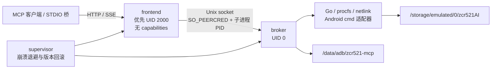

# ZCR521 AI MCP

ZCR521 是面向 Android 8.0–16（API 26–36）的 Root MCP 服务。它把文件、Shell、应用、Root 模块、系统设置、设备控制、网络、诊断、定时和备份能力统一暴露为 48 个 MCP 工具，并同时支持：

- MCP `2026-07-28` 无会话 Streamable HTTP 与 `server/discover`
- 旧版 Streamable HTTP `initialize` / `notifications/initialized` / `ping`
- `2024-11-05` HTTP+SSE `/sse` 与 `/messages`
- `io.modelcontextprotocol/tasks` 的持久任务、进度、更新与取消
- Windows、Linux、macOS 的 STDIO 桥

## 安装

1. 从 GitHub Releases 下载唯一的正式版资源 `ZCR521-Android-AI-MCP.zip`。
2. 在 Magisk、KernelSU/KernelSU Next 或 APatch 模块管理器中安装。
3. 重启；服务默认监听 `5322`，状态页为 `http://127.0.0.1:5322/`。

APatch 官方只支持 ARM64，因此本模块仅声明 APatch `arm64-v8a` 兼容。ZIP 中另外两种 ABI 用于 Magisk、KernelSU 与模拟器。详细步骤见 [安装与升级](docs/INSTALL.md)。

## 端点

| 路径 | 用途 |
|---|---|
| `/mcp` | 当前与旧版 Streamable HTTP |
| `/sse`、`/messages` | 旧式 SSE |
| `/health`、`/version`、`/status` | 存活、版本和只读状态 |
| `/transfer/upload/{id}` | `PUT` + `Content-Range` 续传 |
| `/transfer/download/{id}` | Range 流式下载 |
| `/` | 无外部资源的只读状态页 |

完整工具 Schema 在 [schemas/tools.json](schemas/tools.json)，协议说明在 [MCP 接口](docs/MCP.md)。

服务启动后可执行：

```text
go run ./cmd/zcr521-smoke --endpoint http://127.0.0.1:5322/mcp
```

## 架构



`zcr521d supervisor` 保持前台并管理另外两个进程。frontend 降权失败时会回退到 Root 以保证可用，但 `/status` 会明确返回安全降级原因。

## 构建

固定工具链：

- Go `1.26.5`
- Android NDK `r29` (`29.0.14206865`)
- Android API 26 链接基线
- MCP Go SDK `v1.7.0-pre.3`
- 7-Zip `26.01`，固定源码 SHA-256
- Windows 执行竞态测试时需要 MinGW-w64 GCC；构建脚本不会静默跳过竞态测试

Windows：

```powershell
.\scripts\build.ps1 -PythonPath C:\Python313\python.exe
```

Linux/macOS：

```sh
export ANDROID_NDK_HOME=/absolute/path/to/android-ndk-r29
./scripts/build.sh
```

构建会执行测试、vendoring、三 ABI PIE/16 KiB ELF 验证、模块静态模拟和可复现 ZIP 打包，最终只生成可直接刷入的通用 ZIP；任何 ABI 缺失、空文件、非 ELF、页对齐错误或 `licenses` 子目录重新出现都会失败。构建与验证详情见 [测试报告](docs/TEST-REPORT.md)。

最终 60 项验收证据与设备未测试边界见 [验收追踪表](docs/ACCEPTANCE.md)。

## 数据与卸载

- 内部状态：`/data/adb/zcr521-mcp`
- 用户数据：`/storage/emulated/0/zcr521AI`

升级保留两处数据。卸载脚本只停止经 PID/命令行验证的本模块进程并删除内部状态；用户目录会保留。

## 许可证

项目代码使用 [GPL-3.0-or-later](LICENSE)。第三方依赖与 7-Zip 的组合许可证见 [THIRD_PARTY_NOTICES.md](THIRD_PARTY_NOTICES.md)。
